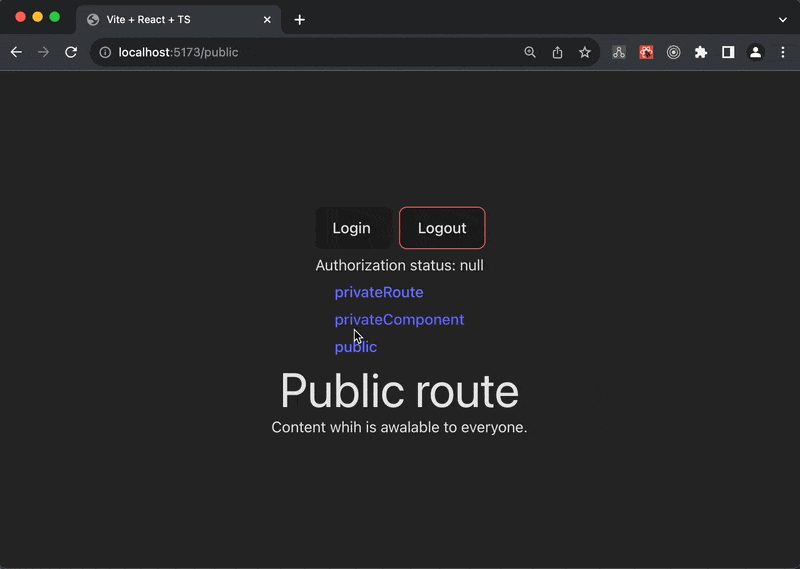

# DEMO: Reactrouter with prtected routes

This example implements a simple version of secure routers that restrict access to unauthorized users.

Authorization is intentionally made simplified, with one button you can authorize and log out of the intended account.

When you are not authorized, you will not be able to access private routes. And in case you are on a private route and log out, a redirect is triggered and you are transferred to a public route.



## 🚀 Quick start

clone this project to your machine and execute following command

```bash
# for start in container
docker-compose up
```

or

```bash
# for start local (without container) development server and tailwind
yarn dev & yarn tailwind
```

## 🚸 A small notice

**Checking access through wrapper components is suitable for interacting with the server through `useEffect`, but not through `actions` & `lodaers`.**

This approach will not be able to restrict access to `actions` & `lodaers` when using them.

It's all about the sequence of initialization of requests and rendering components.
Since actions & lodaers are initialized before rendering components, requests from the client to the server will be sent anyway regardless of whether the user is authorized or not.

The wrapper components responsible for this check are called later. So the only option is to useEffect in this case, which is executed after the component is displayed.
But it's worth keeping in mind that for useEffect to work correctly, you should specify the dependencies at which it will be triggered (URL or component mounting).

#### For example:

When used in lodaers api to receive data where authorization is required, will receive an access error 401, because the component obliged to check the right to send is "still awake".

## 📝 Examples

Protection only _for nested components_

```jsx
import { Navigate, Outlet } from "react-router-dom";
import useAuth from "src/hooks/useAuth";

export function ProtectedComponents({ children }) {
  const { isAuthenticated } = useAuth();

  if (!isAuthenticated) return <Navigate to="/public" />;
  return children;
}
```

Protection only _for nested routes_

```jsx
export function ProtectedRoutes() {
  const { isAuthenticated } = useAuth();
  if (!isAuthenticated) return <Navigate to="/public" />;
  return <Outlet />;
}
```

Universal protection for both nested components and route components

```jsx
export function ProtectedUniversal({ children, redirectPath = "/public" }) {
  const { isAuthenticated } = useAuth();
  if (!isAuthenticated) return <Navigate to={redirectPath} />;
  return children ? children : <Outlet />;
}
```
